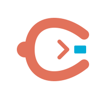

# claw - Universal CLI for claw agent architectures.

<p align="center">
  
</p>

<p align="center">
    One binary to manage agents, watch conversations, and inspect running instances across NanoClaw, OpenClaw, ZeptoClaw, PicoClaw, and others — regardless of which architecture you're running.
</p>


```
claw agent -g main "What is 2+2?"
claw ps
claw watch -g main
claw health
claw api serve
```

## The problem

Every claw architecture ships its own CLI. NanoClaw has a Python script, ZeptoClaw has a shell wrapper, OpenClaw has a web dashboard. When you run multiple architectures — or switch between them — you're juggling different tools with different flags, different output formats, and different ways to find your running agents.

`claw` fixes that.

## How it works

`claw` delegates to architecture-specific driver binaries via newline-delimited JSON on stdin/stdout. Drivers are standalone executables that ship with each claw architecture. No plugins, no shared libraries, no version coupling.

```
claw agent "Review this code" -g dev
  → locates claw-driver-nanoclaw
  → sends agent_request via NDJSON
  → driver spawns container, streams output
  → claw formats and prints the response
```

The same pattern works for listing running agents:

```
$ claw ps
ID                        GROUP                STATE      AGE
nanoclaw-main             main [main]          running    3m 02s
nanoclaw-dev              dev                  running    47m 15s
```

And watching conversations in real time:

```
$ claw watch -g main -n 3
[14:02:11] You: What's the status of the deploy?
[14:02:15] Agent: The deploy completed successfully at 13:58...
[14:03:01] You: Run the post-deploy checks
Watching (Ctrl-C to stop)...
```

Checking installation health:

```
$ claw health
nanoclaw  /Users/you/.claw/drivers/claw-driver-nanoclaw
  ✓  runtime          docker 27.3.1
  ✓  credentials      CLAUDE_CODE_OAUTH_TOKEN valid (expires in 47d)
  ✓  database          ok (messages.db 142MB, 18,432 rows)
  ✗  disk              group dir 94% full (/Users/you/src/nanoclaw/groups)
  ✓  sessions          3 active, 0 stuck
  ✓  groups            4 registered (main, dev, family, work)
  ⚠  image             nanoclaw-agent:latest is 3 versions behind

Overall: WARN  (1 error, 1 warning)
```

Without `--arch`, commands like `ps` query all installed drivers and merge the results into a single table with an ARCH column.

## Commands

```
claw repl                       Interactive REPL — maintains session context across prompts
  -g, --group <name>            Target group by name or folder (fuzzy match)
  -j, --jid <jid>               Target group by exact JID
  -s, --session <id>            Resume an existing session
      --native                  Run agent natively without a container (dev mode, no sandbox)
      --verbose                 Show agent-runner diagnostic output
  Slash commands: /new  /session  /history  /exit  /help

claw agent [prompt]             Send a single prompt to an agent
  -g, --group <name>            Target group by name or folder (fuzzy match)
  -j, --jid <jid>               Target group by exact JID
  -s, --session <id>            Session ID to resume
  -f, --file <path>             Read prompt from a file
  -p, --pipe                    Read prompt from stdin
      --native                  Run agent natively without a container (dev mode, no sandbox)
      --verbose                 Show agent-runner diagnostic output
  Prompt sources combine: -f and --pipe append to the positional arg.

claw ps                         List running agent instances
  --arch <name>                 Query only this architecture
  --json                        Output raw JSON

claw health                     Run health diagnostics on installations
  --arch <name>                 Check a specific architecture
  --all                         Check all installations from all installed drivers
  -g, --group <name>            Check a specific group within an installation
  --watch                       Re-run every --interval seconds
  --interval <seconds>          Polling interval in seconds (default: 30)
  --json                        Emit NDJSON instead of formatted output
  --fail-fast                   Exit 1 on first failed check
  Checks: runtime, credentials, database, disk, sessions, groups, image.
  Exit codes: 0=pass, 1=fail, 2=warn, 3=cannot run.

claw watch                      Stream messages in real time
  -g, --group <name>            Group name or folder (fuzzy match)
  -j, --jid <jid>               Chat JID (exact)
  -n, --lines <N>               History lines to show (default: 20)
  Exits on Ctrl-C.

claw archs                      List installed drivers and their versions

claw api serve                  Start the HTTP+WebSocket API server
  --port <N>                    Port to listen on (default: 7474)
  --bind <addr>                 Address to bind to (default: 127.0.0.1)
  --token <secret>              Enable bearer token authentication
  --source-dir <path>           Target a specific installation directory
  --cors-origin <origin>        Additional allowed CORS origins (repeatable)
  Binds localhost only by default. --bind 0.0.0.0 requires --token.
  REST: /api/v1/{archs,ps,health,groups,sessions}
  WebSocket: /ws/{watch,agent,health}
  See spec/API.md for full endpoint documentation.

claw completion <bash|zsh|fish> Generate shell completion scripts
  --install                     Install to the appropriate system path
```

### Global flags

```
--arch <name>                   Target architecture (e.g. nanoclaw, zepto)
```

## Drivers

Each claw architecture ships a `claw-driver-<arch>` binary that implements the [driver protocol](spec/DRIVER.md). `claw` discovers drivers by searching:

1. `~/.claw/drivers/`
2. `$PATH`

```
$ claw archs
ARCH                 ARCH VER     DRIVER VER   PATH
----------------------------------------------------------------------
nanoclaw             1.2.35       0.1.0        /Users/you/.claw/drivers/claw-driver-nanoclaw
```

Available drivers:

```
claw-driver-nanoclaw   # ships with NanoClaw   ✓ available
claw-driver-zepto      # ships with ZeptoClaw  ✓ available
claw-driver-openclaw   # ships with OpenClaw     planned
claw-driver-pico       # ships with PicoClaw     planned
```

### Writing a new driver

A driver is any executable named `claw-driver-<arch>` that reads NDJSON from stdin and writes NDJSON to stdout. It must handle `version_request` and `probe_request` at minimum; add `ps_request`, `agent_request`, `watch_request`, `health_request`, `groups_request`, and `sessions_request` to support the full command set.

Create a `drivers/<arch>/` directory with its own `go.mod` (or use any language — drivers are just binaries). See [spec/DRIVER.md](spec/DRIVER.md) for the full protocol.

## Building

Requires Go 1.23+.

```bash
# Build and install claw + all drivers (default: ~/.local/bin/)
make install-all

# Override install location:
make install-all PREFIX=/usr/local

# Or separately:
make install           # claw binary only → ~/.local/bin/claw
make install-drivers   # all drivers      → ~/.local/bin/claw-driver-*

# Build without installing (outputs to ./build/)
make build
make build-drivers

# Cross-compile for darwin/linux (amd64 + arm64) → ./build/
make build-all

# Run all tests (claw + all drivers)
make test

# Run linters (requires golangci-lint)
make lint
```

The NanoClaw driver lives in `drivers/nanoclaw/` and has its own `go.mod`. Each driver is built independently; adding a new driver is as simple as creating a `drivers/<arch>/` directory with a binary that implements the [driver protocol](spec/DRIVER.md).

## Shell completions

```bash
# Inline (add to your shell rc file):
source <(claw completion bash)
eval "$(claw completion zsh)"
claw completion fish | source

# Or install to system paths:
claw completion bash --install
claw completion zsh --install
claw completion fish --install
```

## Environment

| Variable | Purpose |
|----------|---------|
| `NANOCLAW_DIR` | Override NanoClaw installation directory (default: auto-detect or `~/src/nanoclaw`) |

## API server

`claw api serve` starts an HTTP+WebSocket server that exposes the driver protocol over the network. It is a thin translation layer — no business logic, just NDJSON-over-subprocess becomes JSON-over-HTTP/WS.

```
$ claw api serve
claw api serve — listening on 127.0.0.1:7474 (2 drivers, auth: off)
```

```
$ curl -s localhost:7474/api/v1/ps | jq
{
  "instances": [
    {"id": "nanoclaw-main", "arch": "nanoclaw", "group": "main", "state": "running", "age": "3m"}
  ]
}
```

The primary consumer is `claw-console` (the web dashboard), but any HTTP client can use it. See [spec/API.md](spec/API.md) for the full endpoint reference.

## Status

NanoClaw and ZeptoClaw drivers complete (v0.1.0). OpenClaw and PicoClaw drivers planned.

Contributions welcome — especially drivers for architectures we haven't seen yet.
